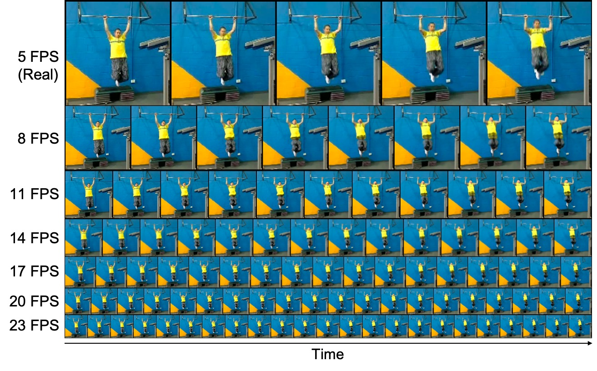

# Vid-ODE - Official PyTorch Implementation

<p align="left"></p>

This repository provides the official PyTorch implementation of the following paper:

> **Vid-ODE: Continuous-Time Video Generation with Neural Ordinary Differential Equation**<br>
> [Sunghyun Park*](https://psh01087.github.io/)<sup>1</sup>, [Kangyeol Kim*](https://www.notion.so/kangyeolk/Kangyeol-Kim-86d81c125e404a98a9527713bd8a355c)<sup>1</sup>, [Junsoo Lee](https://ssuhan.github.io/)<sup>1</sup>, [Jaegul Choo](https://sites.google.com/site/jaegulchoo/)<sup>1</sup>, [Joonseok Lee](http://www.joonseok.net/)<sup>2</sup>, [Sookyung Kim](http://sookyung.net/)<sup>3</sup>, [Edword Choi](https://mp2893.com/)<sup>1</sup><br>
> <sup>1</sup>KAIST, <sup>2</sup>Google Research, <sup>3</sup>Lawrence Livermore Nat’l Lab.<br>
> In AAAI 2021. (* indicates equal contribution)<br>
> Paper : https://arxiv.org/abs/2010.08188<br>
> Project : https://psh01087.github.io/Vid-ODE/<br>

> **Abstract**: *Video generation models often operate under the assumption of fixed frame rates, which leads to suboptimal performance when it comes to handling flexible frame rates (e.g., increasing the frame rate of more dynamic portion of the video as well as handling missing video frames). To resolve the restricted nature of existing video generation models' ability to handle arbitrary timesteps, we propose continuous-time video generation by combining neural ODE (Vid-ODE) with pixel-level video processing techniques. Using ODE-ConvGRU as an encoder, a convolutional version of the recently proposed neural ODE, which enables us to learn continuous-time dynamics, Vid-ODE can learn the spatio-temporal dynamics of input videos of flexible frame rates. The decoder integrates the learned dynamics function to synthesize video frames at any given timesteps, where the pixel-level composition technique is used to maintain the sharpness of individual frames. With extensive experiments on four real-world video datasets, we verify that the proposed Vid-ODE outperforms state-of-the-art approaches under various video generation settings, both within the trained time range (interpolation) and beyond the range (extrapolation). To the best of our knowledge, Vid-ODE is the first work successfully performing continuous-time video generation using real-world videos.*


## Installation
Clone this repository:

```bash
git clone https://github.com/psh01087/Vid-ODE.git
cd Vid-ODE/
```

We support `python3`. Install the dependencies:

```bash
pip install -r requirements.txt
```


## Downloading Datasets

1. [KTH Action](https://drive.google.com/file/d/1WZ-FSTmK-C9mmytUB2SuuwlO-9-K5C3f/view?usp=sharing)
2. [Moving GIF](https://drive.google.com/file/d/1bocNsEJ_AbXKxQUHGKi6oL_nLRH9zr60/view?usp=sharing)
3. [Penn Action](https://drive.google.com/file/d/1oypwRIgzZZ4N_vIxYTgJYiU1qLGOG4lb/view?usp=sharing)
4. [Hurricane](https://drive.google.com/file/d/1bKhYMC1cb5IVPpsnN1FkifcKZ7-OrHQC/view?usp=sharing)

After downloading the dataset and unzipping files, place them under the ```dataset``` folder in current directory.
We preprocess all datasets for training our models.

<!-- ## Downloading pre-trained networks -->


## Training

To train a model on specific dataset, run:

```bash
CUDA_VISIBLE_DEVICES=0 python main.py --phase train --dataset kth
```

All arguments used for this project are described in the function "get_opt()" in ```main.py```. There are a lot of options to train our network on a wide range of datasets and also to evaluate various architectures for writing the paper. However, just for the purpose of executing the proposed method, the number of arguments that you need to change would be very limited.
The following options will be what you need to concern:


```--dataset``` : Specify the dataset to train, select among [kth, penn, mgif, hurricane].<br>
```--extrap``` : If you toggle this option, you can train the extrapolation model.<br>
```--irregular``` : If you toggle this option, you can train the model with irregularly sampled frames.<br>


## Evaluation

We evaluate our model using Structural Similarity (SSIM), Peak Signal-to-Noise Ratio (PSNR), and Learned Perceptual Image Patch Similarity (LPIPS). To evaluate a model on specific dataset, run:

```bash
CUDA_VISIBLE_DEVICES=0 python main.py --phase test_met --dataset kth --test_dir CHECKPOINT_DIR
```


## Citation
If you find this work useful for your research, please cite our [paper](https://arxiv.org/abs/2010.08188):

```
@article{park2020vid,
  title={Vid-ODE: Continuous-Time Video Generation with Neural Ordinary Differential Equation},
  author={Park, Sunghyun and Kim, Kangyeol and Lee, Junsoo and Choo, Jaegul and Lee, Joonseok and Kim, Sookyung and Choi, Edward},
  journal={arXiv preprint arXiv:2010.08188},
  booktitle={The Thirty-Fifth {AAAI} Conference on Artificial Intelligence, {AAAI} 2021},
  pages={online},
  publisher={{AAAI} Press},
  year={2021},
}
```
